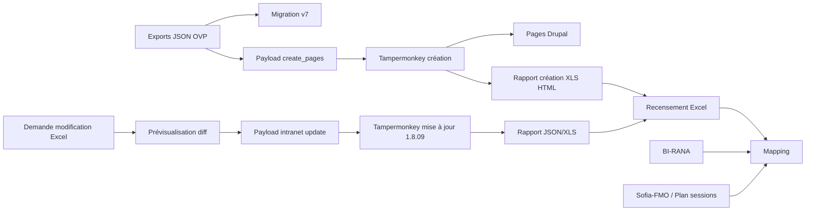

# Cartographie des flux actuels

## Transformations et risques

- Le titre est normalisé dans l'outil de migration, dans le mapping et dans l'agent ; il est parfois utilisé comme clé de secours alors qu'il ne doit rester qu'un indice.
- Les départements existent sous forme de codes `16/17/79/86`, libellés Drupal, préfixes de titre et inférences RNE : même donnée renommée et transformée plusieurs fois.
- Les publics/métiers sont stockés sous labels, chemins Fancytree et valeurs autocomplete ; risque de perte du chemin parent.
- Les thématiques sont stockées comme libellés, tags source et IDs Drupal (`6331`) ; la création ajoute des obligatoires que la mise à jour ne doit pas ajouter.
- Les sessions Sofia-FMO sont recalculées dans le studio puis réinterprétées dans l'agent de mise à jour ; v2 doit résoudre avant export.
- Les rapports de création sont au format Excel HTML et les matrices v2 en XLSX réel ; compatibilité à documenter.
- Les contenus HTML passent par Markdown/source OVP, correction éditoriale, CKEditor source, nettoyage HTML et vérification ; pertes possibles d'attributs ou paragraphes.
- Les associations manuelles, exclusions de prévisualisation et caches localStorage peuvent survivre à un nouvel import sans empreinte de fichier.
