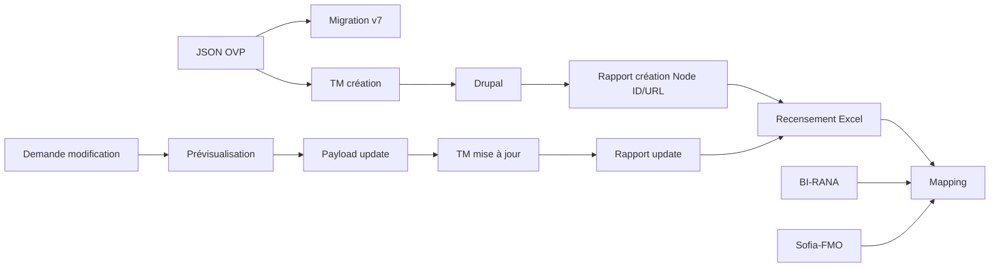

# Cartographie des flux actuels

## Points de fragilité
- Données recalculées: titres normalisés, préfixes départementaux, sessions, places restantes.
- Données renommées: métiers/publics, thématiques, dispositif/module/groupe, URL/pageUrl.
- Transformations divergentes: HTML CKEditor, dates françaises/ISO, nombres avec unités.
- Duplications: Node ID dans Excel, mapping, rapports et payloads.
- Pertes: provenance cellulaire, formules/validations Excel, correspondances faibles ignorées.
- Mauvais identifiants: titres et titres préfixés départementaux utilisés comme clés de rapprochement.
